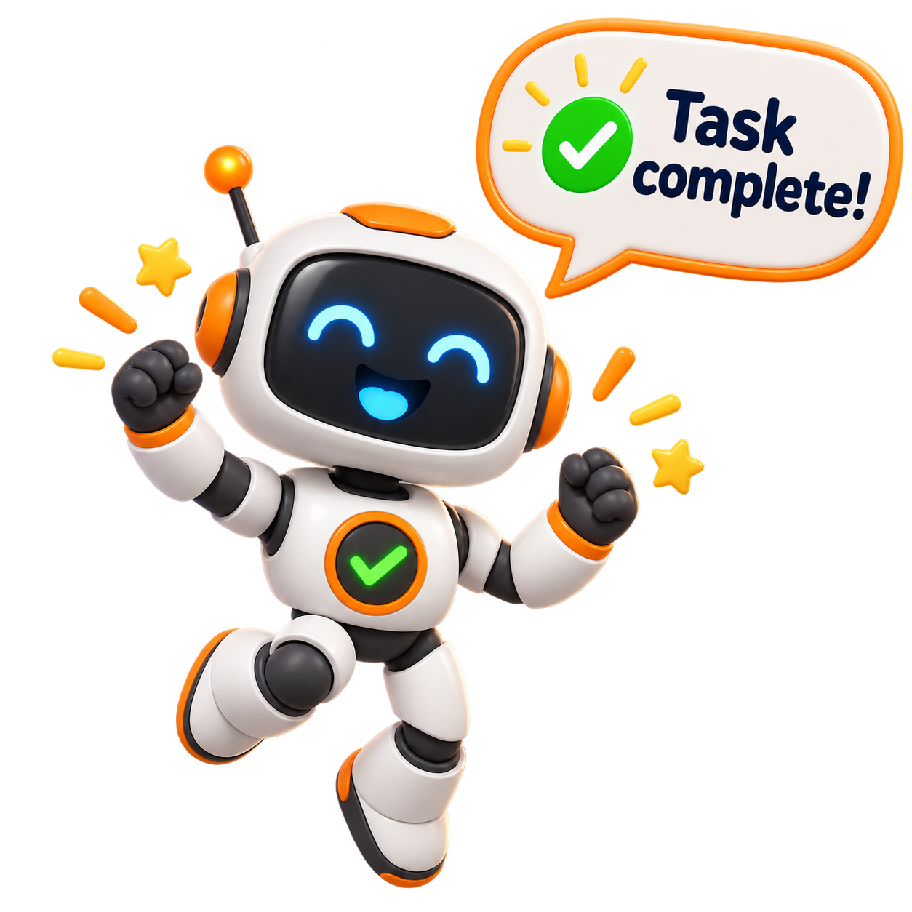
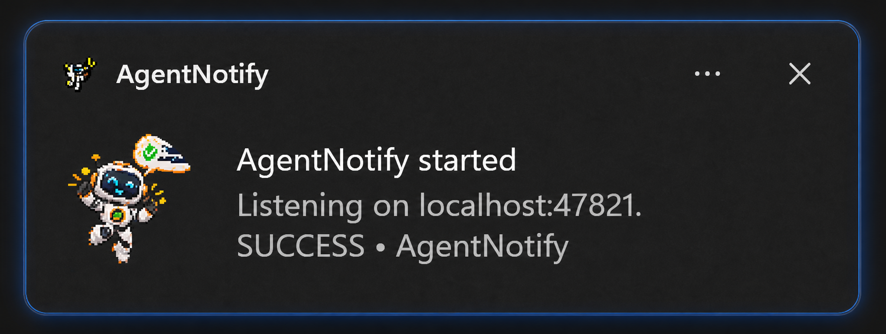

# AgentNotify

<p align="center">
  
</p>

<p align="center">
  A small Windows tray app that gives local AI agents and tools a dependable way to send native desktop notifications.
</p>

AgentNotify runs a localhost-only HTTP service and lives quietly in the Windows notification area. Send one JSON request when a task finishes, fails, needs attention, or has useful progress to report; AgentNotify turns it into a native Windows toast.

## Why AgentNotify

AgentNotify is especially useful when your agent runs through a CLI in WSL, where native Windows notifications are not readily available. It also fits agent harnesses inside VS Code (and similar local development environments) that need a simple, dependable way to surface completion, failure, and attention-needed events.

In short, any agent running on your local machine can send a request to AgentNotify and produce a native Windows toast—with the appropriate sound included—without needing its own notification integration.

## Features

- **Local by design** — the listener is bound to `localhost`; it is not exposed to the network.
- **Native Windows toasts** — notifications include a level-specific title, sound, source label, and the task-complete robot artwork.
- **Four notification levels** — `info`, `success`, `warning`, and `error`, each with sensible defaults.
  - `info` uses the default Windows notification sound.
  - `success` uses the reminder sound.
  - `warning` uses the Alarm 2 sound.
  - `error` uses the alarm sound.
- **Open links from a toast** — optionally add an `http`, `https`, `vscode`, `vscode-insiders`, or `cursor` URL to an **Open** button.
- **Tray controls** — see the current listener port, change it, or exit from the system-tray menu.
- **Port persistence** — the selected port is remembered for the next launch; the default is `47821`.
- **Safe request bounds** — payloads are limited to 16 KB and user-facing fields are length-limited.

## Requirements

- Windows 10 version 2004 (build 19041) or later
- .NET 8 SDK when building from source

## Run locally

From the repository root:

```powershell
dotnet run --project .\AgentNotify.csproj
```

The app appears in the system tray and immediately starts listening at `http://localhost:47821`. A startup notification confirms the active port.

To use a specific port for this launch:

```powershell
dotnet run --project .\AgentNotify.csproj -- --port 47822
```

You can also right-click the tray icon and choose **Set port…**. That choice is persisted at `%LOCALAPPDATA%\AgentNotify\settings.json`.

## Send a notification

<p align="center">
  
</p>

First, verify that the service is running:

```powershell
Invoke-RestMethod http://localhost:47821/health
```

Then post a notification:

```powershell
$body = @{
  source  = 'Codex'
  title   = 'Task complete'
  message = 'The build and tests passed.'
  level   = 'success'
  url     = 'vscode://file/C:/path/to/project'
  id      = 'build-2026-08-30'
} | ConvertTo-Json

Invoke-RestMethod `
  -Method Post `
  -Uri http://localhost:47821/notify `
  -ContentType 'application/json' `
  -Body $body
```

The `id` is optional. When supplied with a `source`, it gives the notification a stable Windows tag so later notifications with the same pair are grouped as the same item.

### Request fields

| Field | Required | Description |
| --- | --- | --- |
| `source` | No | The sender shown in the toast (default: `agent`). |
| `title` | No | Toast title. Defaults vary by level. |
| `message` | No | Main notification text (default: `Task completed.`). |
| `level` | No | One of `info`, `success`, `warning`, or `error` (default: `success`). |
| `url` | No | URL opened by the toast’s **Open** button. Allowed schemes: `https`, `http`, `vscode`, `vscode-insiders`, and `cursor`. |
| `id` | No | Stable identifier used with `source` to tag the toast. |

Example response:

```json
{
  "ok": true,
  "source": "Codex",
  "level": "success",
  "id": "build-2026-08-30"
}
```

## Build a distributable executable

The project is configured for a self-contained 64-bit Windows build:

```powershell
dotnet publish .\AgentNotify.csproj -c Release -r win-x64 --self-contained true -o .\publish
```

Run `publish\AgentNotify.exe` after publishing. Keep the generated `Resources` folder beside the executable so the robot art is available in notifications and the port dialog.

## Troubleshooting

- **No toast appears:** Check that Windows notifications are enabled and that AgentNotify is still running in the system tray.
- **The port is unavailable:** Choose **Set port…** from the tray menu or start with `--port <number>`.
- **A request is rejected:** Confirm `level` is one of the four allowed values and that `url` uses an allowed scheme.
- **Need diagnostic details:** Check `%LOCALAPPDATA%\AgentNotify\agentnotify.log`.

## API summary

| Method | Path | Purpose |
| --- | --- | --- |
| `GET` | `/health` | Returns the active port and a simple service-health response. |
| `POST` | `/notify` | Shows a native Windows notification from the JSON request body. |

## License

No license has been specified for this repository yet.
